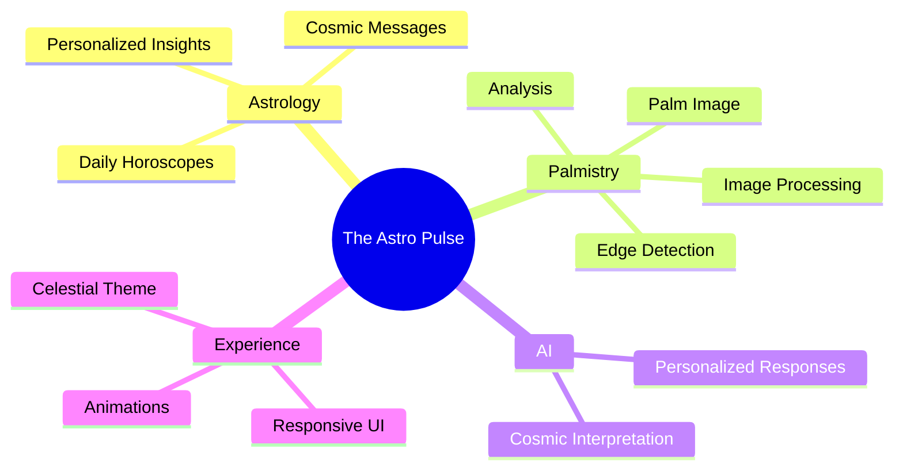
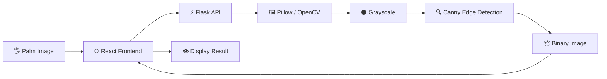
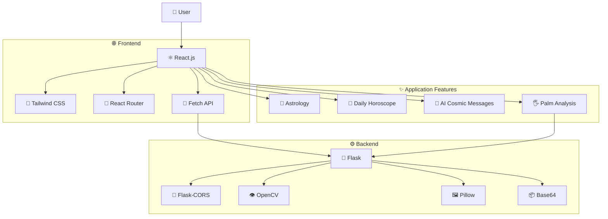
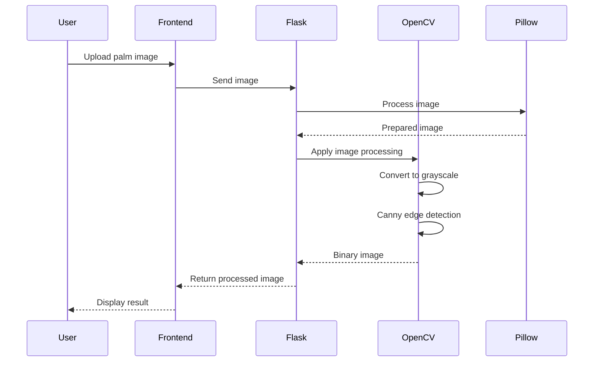
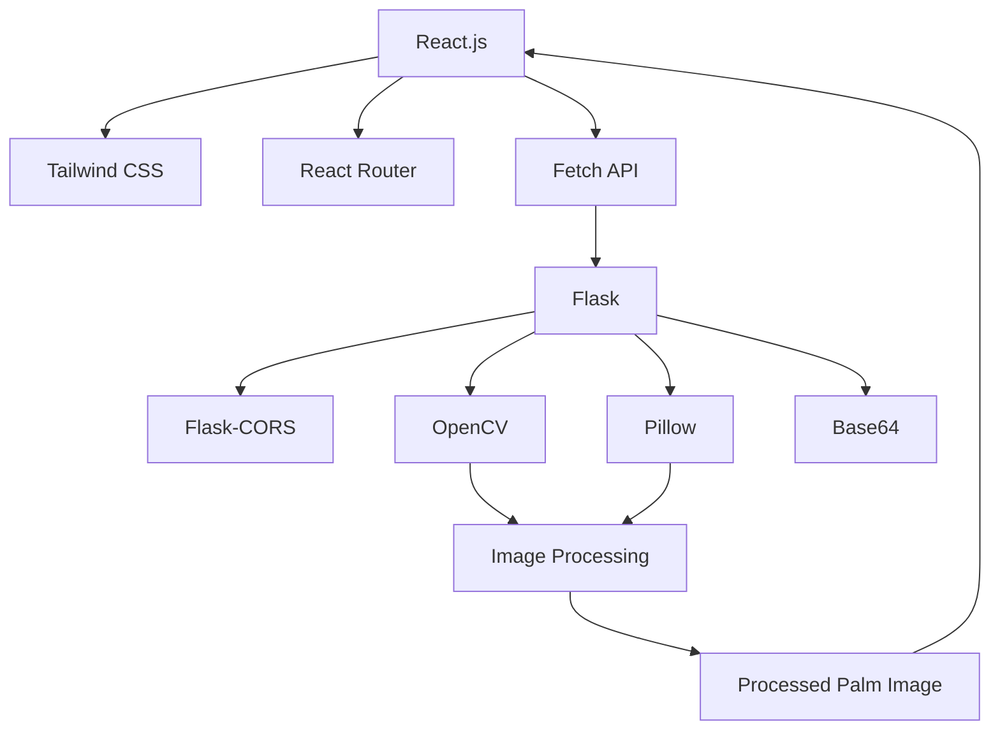
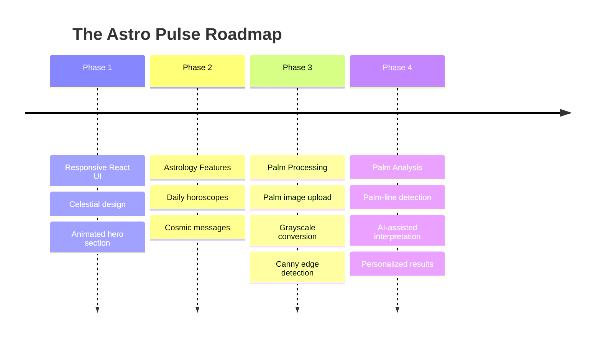

<h1 align="center">✨ The Astro Pulse ✨</h1>

<p align="center">
  <strong>Explore your cosmic blueprint with AI-powered astrology & palmistry.</strong>
</p>

<p align="center">
  
</p>

<p align="center">
  <em>Ancient wisdom × Modern AI × Cosmic exploration</em>
</p>

---

## 🌟 Overview

**The Astro Pulse** is an AI-powered web application that brings together the traditional concepts of **palmistry** and **astrology** with modern artificial intelligence.

The project is designed to provide users with an interactive and visually immersive experience for exploring:

* 🔮 Daily horoscopes
* ✨ Personalized AI-generated cosmic messages
* 🖐️ AI-assisted palm analysis *(currently under development)*
* 🌌 Celestial-themed interactive experiences

The application combines a responsive **React + Tailwind CSS frontend** with a **Python Flask backend** for image processing and AI-related functionality.

---

## 🎯 What The Astro Pulse Does



---

## 🚀 Features

### 🌌 Responsive & Immersive Frontend

The frontend is built with **React** and **Tailwind CSS**, focusing on a modern celestial aesthetic.

* ⚛️ React-based UI
* 🎨 Tailwind CSS styling
* ✨ Smooth animations
* 📱 Mobile-first responsive design
* 🍔 Responsive hamburger navigation
* 🌠 Animated hero section
* 🧭 Client-side routing
* 🔗 API communication using browser `fetch`

---

### 🧠 Palm Image Processing

> 🚧 **Work in progress**

The backend currently provides the foundation for palm-image processing.

The processing pipeline includes:

1. Upload a palm image
2. Receive the image through the Flask backend
3. Convert the image to grayscale
4. Apply Canny edge detection
5. Generate a binary representation
6. Return the processed image to the frontend



---

## 🏗️ System Architecture

The overall application can be visualized as follows:



---

## 🔄 Application Flow

The typical palm-analysis flow follows this sequence:



---

## 🧩 Technology Stack

### 🌐 Frontend

| Technology          | Purpose                     |
| ------------------- | --------------------------- |
| ⚛️ React.js         | User interface              |
| 🎨 Tailwind CSS     | Styling & responsive design |
| 🧭 React Router DOM | Client-side routing         |
| 🎯 React Icons      | UI icons                    |
| 🔗 Fetch API        | Backend/API communication   |

### ⚙️ Backend

| Technology    | Purpose                          |
| ------------- | -------------------------------- |
| 🐍 Flask      | REST API server                  |
| 🔐 Flask-CORS | Cross-origin communication       |
| 👁️ OpenCV    | Computer vision & edge detection |
| 🖼️ Pillow    | Image processing                 |
| 📦 Base64     | Image encoding                   |

---

## 📊 Technology Architecture



---

# ⚙️ Installation & Setup

## 1️⃣ Clone the Repository

```bash
git clone https://github.com/your-username/the-astro-pulse.git
cd the-astro-pulse
```

---

## 2️⃣ Backend Setup

Move into the backend directory:

```bash
cd backend
```

Create a Python virtual environment:

### Linux / macOS

```bash
python -m venv venv
source venv/bin/activate
```

### Windows

```bash
python -m venv venv
venv\Scripts\activate
```

Install dependencies:

```bash
pip install -r requirements.txt
```

Start the Flask server:

```bash
python app.py
```

---

## 3️⃣ Frontend Setup

Open a new terminal and move into the frontend directory:

```bash
cd frontend
```

Install dependencies:

```bash
npm install
```

Start the development server:

```bash
npm run dev
```

---

## 🗂️ Project Structure

A typical project structure can be organized like this:

```text
the-astro-pulse/
│
├── frontend/
│   ├── src/
│   ├── public/
│   ├── package.json
│   └── ...
│
├── backend/
│   ├── app.py
│   ├── requirements.txt
│   └── ...
│
├── README.md
└── ...
```

---

## 🔮 Development Roadmap



> 🚧 Palm analysis is currently a work in progress.

---

## 🧪 Current Development Status

| Feature                   | Status            |
| ------------------------- | ----------------- |
| React frontend            | ✅ Available       |
| Tailwind styling          | ✅ Available       |
| Responsive navigation     | ✅ Available       |
| Animated hero             | ✅ Available       |
| Daily horoscopes          | ✅ Available       |
| AI cosmic messages        | ✅ Available       |
| Palm image processing     | 🚧 In development |
| Palm-line interpretation  | 🚧 Planned        |
| Advanced AI palm analysis | 🔮 Planned        |

---

## 🌌 Vision

The long-term goal of **The Astro Pulse** is to create an immersive platform where traditional astrology and palmistry concepts can be explored through modern AI and computer-vision technologies.

The project aims to make the experience:

**Mystical → Interactive → Intelligent → Personalized**

---

## 🤝 Contributing

Contributions, ideas, and improvements are welcome.

If you would like to contribute:

```bash
# Fork the repository

# Create a feature branch
git checkout -b feature/your-feature

# Commit your changes
git commit -m "Add your feature"

# Push your branch
git push origin feature/your-feature
```

Then open a pull request.

---

## 📜 License

Add your preferred open-source license here.

For example:

```text
MIT License
```

---

## ✨ Final Note

**The Astro Pulse** sits at the intersection of:

> 🌌 Ancient cosmic wisdom
> 🤖 Modern artificial intelligence
> 👁️ Computer vision
> 💻 Modern web technology

**Explore the stars. Read the lines. Discover your cosmic pulse.**

---

<p align="center">
  Made with ✨ curiosity, 🤖 AI & 🌌 cosmic inspiration
</p>
